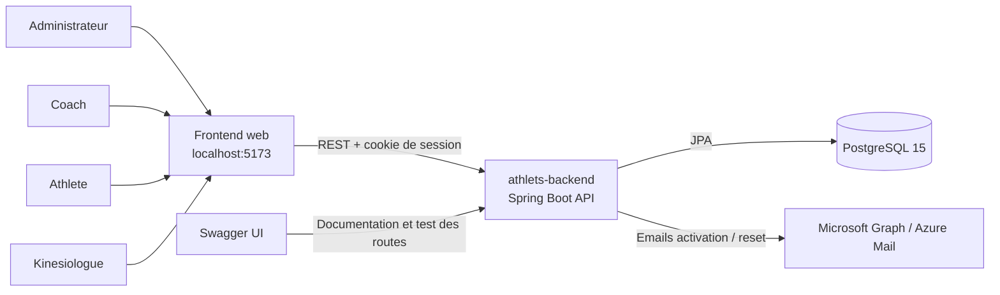
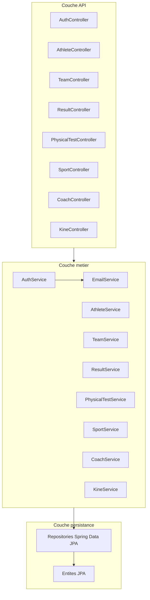
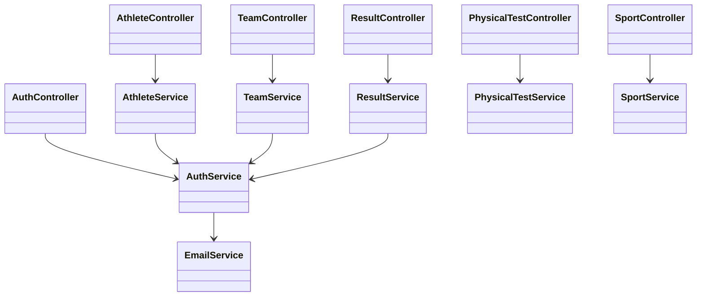
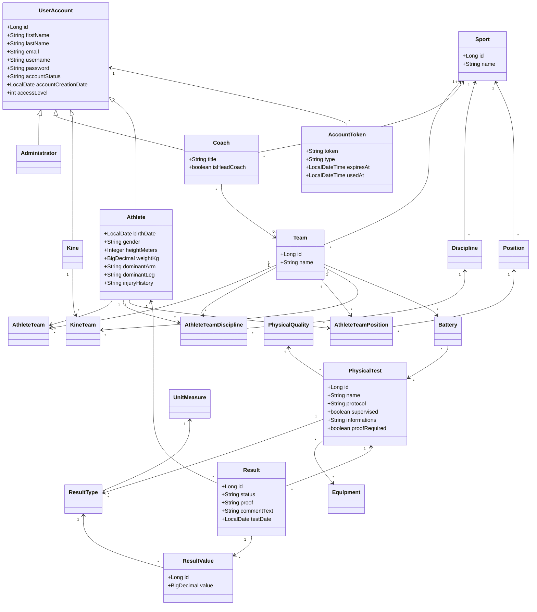
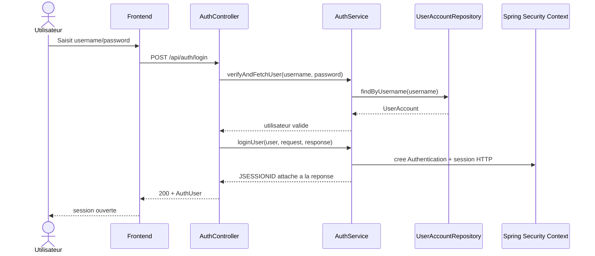
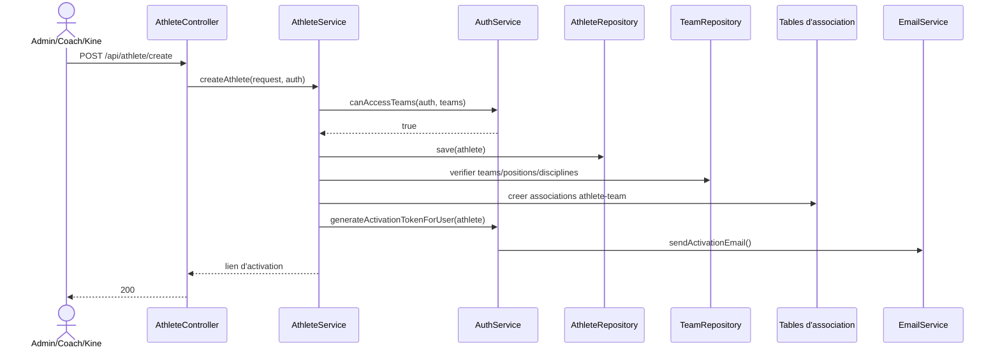
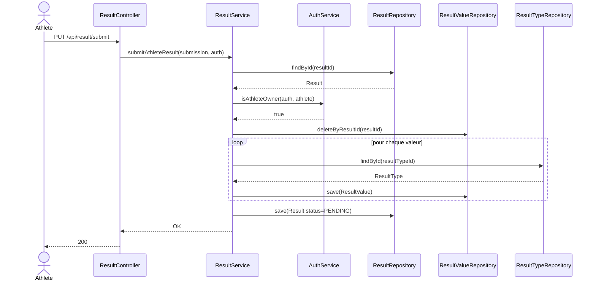
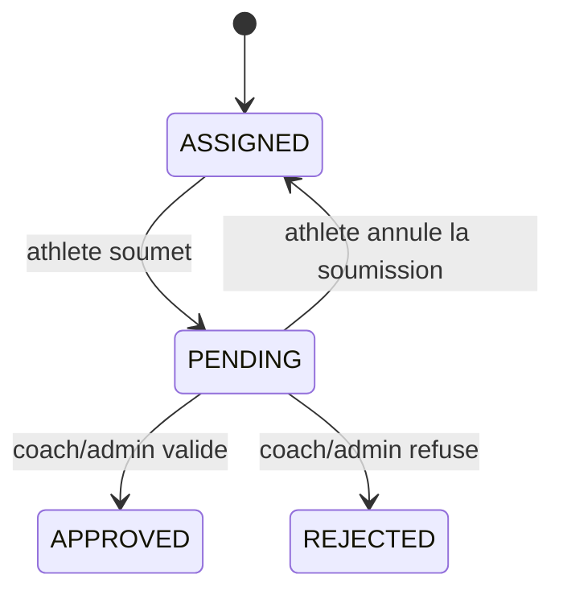
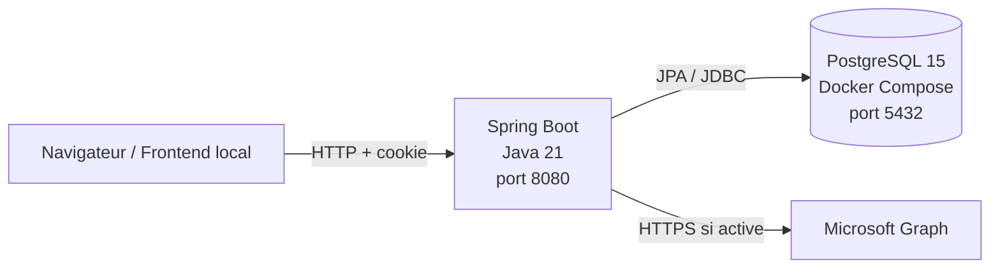
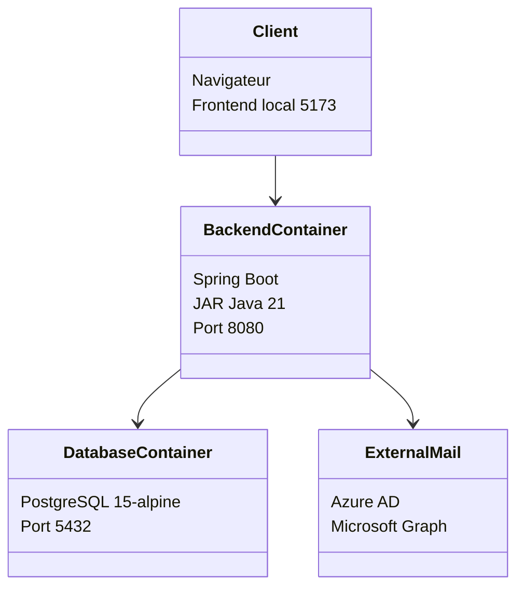

# Rapport d'architecture arc42

## 1. Introduction et objectifs

### 1.1 Vue d'ensemble

`athlets-backend` est un service backend Spring Boot pour le suivi d'athletes, d'equipes, de tests physiques et de resultats. Le projet expose une API REST securisee par session HTTP, persiste ses donnees dans PostgreSQL et initialise un jeu de donnees de developpement via `schema.sql` et `data.sql`.

Le systeme couvre principalement :

- l'authentification, l'activation de compte et la reinitialisation de mot de passe ;
- la gestion des athletes, coachs, kinesiologues, equipes et sports ;
- la definition de tests physiques, de batteries de tests et de types de resultats ;
- l'assignation, la soumission, la validation et l'export des resultats.

### 1.2 Objectifs qualite

| Priorite | Objectif | Interpretation pour ce projet |
|---|---|---|
| 1 | Securite | Controler l'acces aux routes selon le type d'utilisateur et proteger les flux sensibles de compte. |
| 2 | Coherence metier | Garantir que les relations athlete-equipe-discipline-position et les validations de resultats restent valides. |
| 3 | Maintenabilite | Garder une separation claire entre controleurs, services, repositories, DTO et entites JPA. |
| 4 | Evolutivite | Permettre l'ajout de nouveaux sports, tests, result types et integrations externes. |
| 5 | Operabilite | Lancer facilement l'application en local avec Docker Compose, PostgreSQL et Swagger. |

### 1.3 Parties prenantes

| Partie prenante | Attente principale |
|---|---|
| Administrateur | Gerer les comptes, equipes, athletes et les donnees de reference. |
| Coach | Gerer ses athletes, ses equipes, les batteries et les resultats de son perimetre. |
| Kinesiologue | Consulter et administrer les athletes/equipes auxquels il est rattache. |
| Athlete | Consulter ses informations et soumettre ses resultats. |
| Equipe de developpement | Faire evoluer rapidement le backend sans casser les regles metier. |
| Exploitation / DevOps | Demarrer l'environnement simplement et comprendre les dependances externes. |

## 2. Contraintes d'architecture

- Backend Java 21 avec Spring Boot et build Maven.
- Persistance via Spring Data JPA sur PostgreSQL.
- Securite basee sur Spring Security et session HTTP (`JSESSIONID`), pas sur JWT.
- Documentation API via Springdoc OpenAPI / Swagger UI.
- Initialisation de base de donnees par scripts SQL, sans outil de migration type Flyway/Liquibase.
- Environnement local prevu avec Docker Compose et une base PostgreSQL en conteneur.
- Integration email optionnelle via Microsoft Graph / Azure AD.

## 3. Contexte et perimetre

### 3.1 Contexte metier

Le backend sert d'orchestrateur central entre un frontend web, les utilisateurs du centre sportif et les services de persistance / notification. Il gere les comptes, les equipes et le cycle de vie des tests physiques.

### 3.2 Diagramme de contexte



### 3.3 Interfaces externes

- `Frontend web` : client principal consommant les routes REST et le cookie de session.
- `PostgreSQL` : stockage relationnel des comptes, equipes, tests et resultats.
- `Microsoft Graph` : envoi optionnel des emails d'activation et de reinitialisation.
- `Swagger UI` : exploration des routes exposees.

## 4. Strategie de solution

La solution suit une architecture applicative classique Spring Boot :

- couche `controller` pour exposer l'API REST ;
- couche `service` pour les regles metier et les controles d'acces plus fins ;
- couche `repository` pour l'acces aux entites JPA ;
- couche `entity` et tables SQL pour le modele relationnel ;
- couche `dto` pour limiter le couplage entre API et entites ;
- configuration centralisee pour securite, datasource, CORS et email.

Principes structurants :

- securite coarse-grained dans `SecurityConfig`, puis securite fine via `@PreAuthorize` et `AuthService` ;
- heritage JPA `JOINED` pour representer les types d'utilisateurs ;
- associations explicites pour les relations n-n enrichies (`Athlete_Team`, positions, disciplines, `Kine_Team`) ;
- gestion du cycle des resultats par statut ;
- export bureautique des resultats via Apache POI.

## 5. Vue des blocs de construction

### 5.1 Vue de niveau 1



### 5.2 Vue de niveau 2 par sous-domaines

| Sous-domaine | Responsabilite principale | Composants |
|---|---|---|
| Authentification | Login, logout, activation, reset, verification des permissions | `AuthController`, `AuthService`, `AccountTokenRepository`, `EmailService` |
| Utilisateurs | Gestion des athletes, coachs, kines et comptes | `AthleteService`, `CoachService`, `KineService`, entites `UserAccount`, `Athlete`, `Coach`, `Kine` |
| Organisation sportive | Sports, disciplines, positions, equipes | `SportService`, `TeamService`, repositories associes |
| Evaluation physique | Tests, result types, equipements, batteries | `PhysicalTestService`, entites `PhysicalTest`, `Battery`, `ResultType`, `Equipment` |
| Resultats | Assignation, soumission, validation, export Excel | `ResultService`, entites `Result`, `ResultValue` |

### 5.3 Diagramme de composants



### 5.4 Diagramme de classes du domaine principal



## 6. Vue d'execution

### 6.1 Scenario UML - authentification



### 6.2 Scenario UML - creation d'un athlete



### 6.3 Scenario UML - soumission d'un resultat



### 6.4 Diagramme d'etat du resultat



## 7. Vue de deploiement

### 7.1 Environnement de developpement



### 7.2 Noeuds de deploiement



### 7.3 Infrastructure observee

- `docker-compose.yml` demarre `postgres:15-alpine`.
- `Dockerfile` construit le JAR avec Maven puis l'execute sur `eclipse-temurin:21-jre-alpine`.
- Le backend local utilise `application.yml` pour pointer par defaut vers `jdbc:postgresql://localhost:5432/athlete_tracker`.
- Le CORS autorise explicitement `http://localhost:5173`.

## 8. Concepts transverses

### 8.1 Securite

- Authentification par verification manuelle du mot de passe puis creation de session Spring Security.
- Autorisation centralisee via `AuthService` et `@PreAuthorize`.
- Typage des utilisateurs par niveau d'acces (`ADMIN`, `COACH`, `ATHLETE`, `KINE`).
- Points publics limites : login, activation, generation temporaire de token d'activation, reset password et Swagger.

### 8.2 Modele de persistance

- Heritage `JOINED` sur `UserAccount` pour les sous-types d'utilisateurs.
- Tables d'association explicites pour porter la semantique metier.
- Initialisation complete du schema avec `schema.sql`.
- Donnees de demonstration chargees via `data.sql`.

### 8.3 Contrats API

- API REST en JSON.
- DTO dedies pour les entrees/sorties sensibles.
- Swagger UI pour l'exploration.
- Export binaire Excel pour les resultats via `GET /api/result/export`.

### 8.4 Integration email

- Service d'email optionnel, active par `app.mail.enabled`.
- Dependance a Azure AD pour l'obtention d'un jeton et a Microsoft Graph pour l'envoi.
- Utilise pour l'activation de compte et la reinitialisation du mot de passe.

### 8.5 Validation metier

- verification de l'appartenance des athletes/equipes selon l'utilisateur connecte ;
- verification de la coherence sport-position-discipline ;
- invalidation des anciens tokens actifs avant emission d'un nouveau ;
- verification des preuves et des result types lors de la soumission d'un resultat.

## 9. Decisions d'architecture

| Decision | Motivation | Consequence |
|---|---|---|
| Session HTTP plutot que JWT | Simplicite d'integration avec Spring Security et frontend web classique | Bonne simplicite locale, mais couplage plus fort au navigateur et aux cookies |
| Heritage JPA `JOINED` pour les utilisateurs | Mutualiser les attributs de compte tout en gardant des tables specialisees | Requetes parfois plus complexes mais modele plus propre |
| Scripts SQL plutot que migrations versionnees | Demarrage rapide d'un prototype/backend de cours | Risque d'evolution schema moins controlee |
| Services metier riches | Centraliser les validations et droits d'acces | Bonne lisibilite metier, mais certains services deviennent volumineux |
| Tables d'association explicites | Porter les relations enrichies athlete-equipe-position-discipline | Complexite supplementaire mais meilleure expressivite metier |
| Export Excel via Apache POI | Repondre a un besoin metier de restitution bureautique | Ajoute une dependance technique et du code de formatage |

## 10. Scenarios de qualite

### 10.1 Securite

Scenario : un athlete tente de soumettre le resultat d'un autre athlete.  
Attendu : `ResultService` refuse l'action via `AuthService.isAthleteOwner(...)` et leve une erreur d'autorisation.

### 10.2 Coherence metier

Scenario : un coach cree un athlete avec une position qui n'appartient pas au sport de l'equipe.  
Attendu : `AthleteService` rejette la requete avec une `IllegalArgumentException`.

### 10.3 Disponibilite locale

Scenario : un developpeur clone le projet et lance le backend.  
Attendu : Spring demarre la base PostgreSQL via Docker Compose, charge `schema.sql` et `data.sql`, puis expose Swagger sur `http://localhost:8080/swagger-ui/index.html#/`.

### 10.4 Evolutivite

Scenario : l'equipe ajoute un nouveau test physique avec plusieurs types de resultats.  
Attendu : `PhysicalTestService` persiste le test, ses equipements et ses `ResultType` sans modifier les autres sous-domaines.

## 11. Risques techniques et dette

- L'absence de migrations versionnees rend les evolutions de schema plus risquees.
- Les autorisations sont basees sur `accessLevel` numerique plutot que sur de vraies authorities Spring.
- Certaines routes publiques de developpement, comme la generation de token d'activation, devront etre retirees ou protegees en production.
- Le CORS est code en dur sur `http://localhost:5173`.
- Les services `AuthService`, `AthleteService`, `TeamService` et `ResultService` concentrent beaucoup de logique et meriteront peut-etre un decoupage futur.
- Le backend journalise encore certains liens sensibles en console.

## 12. Glossaire

| Terme | Definition |
|---|---|
| Athlete | Utilisateur final rattache a une ou plusieurs equipes, qui soumet ses resultats. |
| Coach | Utilisateur encadrant une equipe, pouvant gerer certains athletes et valider des resultats. |
| Kine | Kinesiologue associe a une ou plusieurs equipes. |
| Team | Equipe sportive rattachee a un sport et a des membres. |
| Battery | Regroupement de plusieurs tests physiques pour une equipe. |
| Physical Test | Test unitaire definissant protocole, qualite physique, equipements et types de mesure. |
| Result | Assignation ou soumission d'un test pour un athlete, avec statut metier. |
| Result Value | Valeur mesuree pour un type de resultat d'un test. |
| Account Token | Jeton temporaire d'activation ou de reinitialisation de mot de passe. |

## Annexes

### Routes principales identifiees

- `POST /api/auth/login`
- `POST /api/auth/activate`
- `POST /api/auth/password-reset/request`
- `POST /api/auth/password-reset/confirm`
- `PUT /api/auth/{userId}/deactivate`
- `POST /api/athlete/create`
- `GET /api/athlete/all`
- `GET /api/athlete/current`
- `PUT /api/athlete/{id}`
- `GET /api/team/teams`
- `POST /api/team`
- `POST /api/physicalTest/create`
- `POST /api/physicalTest/battery/create`
- `GET /api/physicalTest`
- `POST /api/result/assign`
- `PUT /api/result/submit`
- `PUT /api/result/verify/{testResultId}/{approved}`
- `GET /api/result/export`

### Structure logique resumee

```text
com.centresportifets.athlets_backend
|- auth
|- core.security
|- email
|- result
|- sport
|  |- discipline
|  |- position
|- team
|- tests
|  |- battery
|  |- equipment
|- user
   |- administrator
   |- athlete
   |- coach
   |- kine
```
